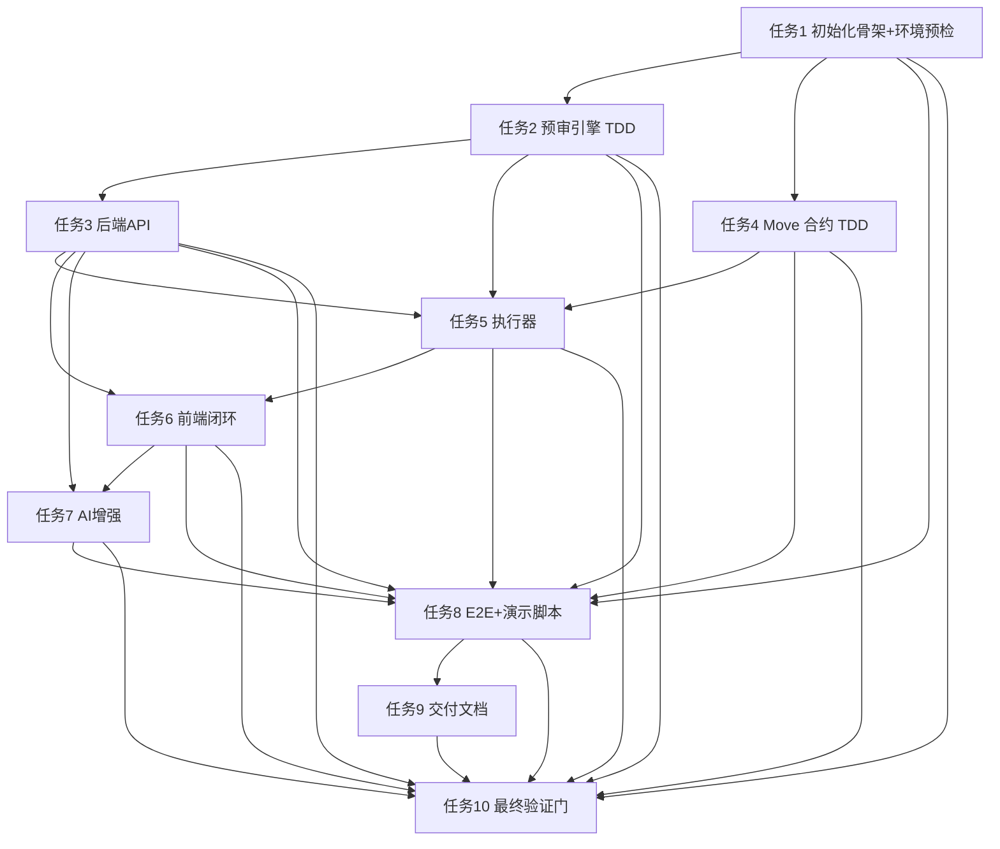

# Sui 安全中间层工程执行提示图（最终版）

## 1. 目标锚定
- 最终目标：48 小时跑通最小闭环（预审 -> 人工签名闸门 -> 执行 -> 审计日志）。
- 黑客松验收：可运行、可验证、可演示、可回退。
- AI定位：增强解释与总结，不接管最终放行控制（有 key 调真实 API，失败自动回退模板）。

## 2. 执行总图（按依赖）


## 3. Superpowers 执行提示词（可直接复制）

### 3.1 启动执行（总控）
```text
请严格按 docs/plans/2026-02-26-sui-safety-middleware-mvp.md 执行。
要求：
1) 必须遵守 Depends on，不允许跳步。
2) 每个步骤先判断 Expected（成功/失败判定）再进入下一步。
3) 任一步失败，先执行该步 If failed（异常回退），仍失败再停止并汇报阻塞。
4) 仅实现最小可行版本，不做额外抽象。
5) 每完成一个任务，输出：已改文件、测试结果、剩余风险。
```

### 3.2 单任务执行模板
```text
执行任务 X（仅此任务）。
前置检查：确认 Depends on 已全部完成。
执行要求：
- 严格按 Step 1..N 顺序执行。
- 先测试失败，再最小实现，再测试通过。
- 使用文档中给出的示例代码/脚本。
- 输出本任务验收结论：通过/不通过 + 证据。
```

### 3.3 阻塞恢复模板
```text
当前卡在任务 X 的 Step Y。
请按文档中的 If failed（异常回退）逐条执行并汇报：
- 回退动作1结果
- 回退动作2结果
- 是否恢复
若仍失败，请给出最小阻塞原因和可选替代路径（不偏离MVP范围）。
```

## 4. 关键验收点（提示图必须盯住）
- Gate A：环境可用（Node>=20, Sui>=1.25）。
- Gate B：预审规则三分支正确（allow/review/block）。
- Gate C：高风险未确认绝不执行。
- Gate D：审计日志可查询且可回放。
- Gate E：E2E 三路径通过（低风险、高风险确认、异常回退）。

## 5. 演示提示图（3-5分钟）
1. 展示输入交易（地址+金额）。
2. 调 `precheck`，显示 risk/action。
3. 低风险直过一次。
4. 高风险触发人工确认后再执行一次。
5. 查询审计日志，展示 `tx_digest/action/status`。
6. 演示一次失败回退（签名超时或日志写入失败）。

## 6. 终局定义（Done）
- 代码：任务 1-10 全部完成。
- 质量：lint/test/move test 全绿。
- 证据：计划文档写入验证时间戳与输出摘要。
- 可演示：脚本可复跑，评委能复现核心路径。
